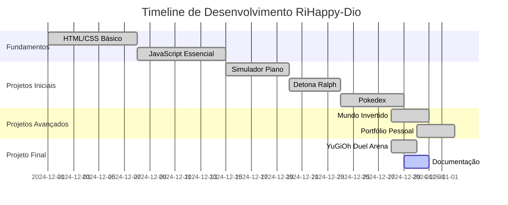

# 🚀 RiHappy-Dio - Portfólio de Projetos


**Portfólio completo com projetos desenvolvidos durante o bootcamp da Digital Innovation One**

<div align="center">
  
  
  
  
  
  
  
  
  
</div>

## 📋 Sobre o Projeto

Este repositório contém **todos os projetos front-end** desenvolvidos por **Peterson Paris (Ralfendeck25)** durante sua jornada no bootcamp da **Digital Innovation One (DIO)**. Cada projeto representa uma habilidade específica em desenvolvimento web, desde fundamentos até projetos complexos com consumo de API.

### 🎯 Missão
Demonstrar a evolução como desenvolvedor front-end através de projetos práticos, interativos e bem documentados.

### 🌟 Destaques
- ✅ 8+ projetos completos
- ✅ 100% responsivo
- ✅ Código limpo e comentado
- ✅ Deploy automático no GitHub Pages
- ✅ Documentação detalhada

## 🏠 Portfólio Online

### 🌐 **Acesse o Portfólio Completo:**
👉 **[https://ralfendeck25.github.io/RiHappy-Dio/](https://ralfendeck25.github.io/RiHappy-Dio/)**

## 📊 Índice de Projetos

| 🎮 Projeto | 📝 Descrição | 🛠️ Tecnologias | 🚀 Status | 🌐 Demo |
|------------|--------------|----------------|-----------|---------|
| **[YuGiOh Duel Arena](./YuGiOh/src/)** | Jogo completo de cartas YuGiOh | HTML, CSS, JS, RPG UI | ✅ Completo | [🔗 Demo](https://ralfendeck25.github.io/RiHappy-Dio/YuGiOh/src/) |
| **[Simulador de Piano](./simulador-piano/)** | Piano virtual interativo | HTML, CSS, JS, Web Audio | ✅ Completo | [🔗 Demo](https://ralfendeck25.github.io/RiHappy-Dio/simulador-piano/) |
| **[Pokedex](./pokedex/)** | Buscador de Pokémon com API | HTML, CSS, JS, REST API | ✅ Completo | [🔗 Demo](https://ralfendeck25.github.io/RiHappy-Dio/pokedex/) |
| **[Detona Ralph](./DetonaRalph/)** | Jogo de cliques com temporizador | HTML, CSS, JS | ✅ Completo | [🔗 Demo](https://ralfendeck25.github.io/RiHappy-Dio/DetonaRalph/) |
| **[Mundo Invertido](./LandingPage-mundo-invertido/)** | Landing Page Stranger Things | HTML, CSS, JS, Animations | ✅ Completo | [🔗 Demo](https://ralfendeck25.github.io/RiHappy-Dio/LandingPage-mundo-invertido/) |
| **[Portfólio Pessoal](./portfolio-frontend/)** | Meu portfólio profissional | HTML, CSS, JS | ✅ Completo | [🔗 Demo](https://ralfendeck25.github.io/RiHappy-Dio/portfolio-frontend/) |
| **[Jogo Detona](./JogoDetona/)** | Outra versão do jogo | HTML, CSS, JS | ✅ Completo | [🔗 Demo](https://ralfendeck25.github.io/RiHappy-Dio/JogoDetona/) |
| **[Projeto Emoji](./emoji/)** | Projeto com emojis interativos | HTML, CSS, JS | ✅ Completo | [🔗 Demo](https://ralfendeck25.github.io/RiHappy-Dio/emoji/) |
| **[Multiverso Spider-Man](./multiverso%20SpiderMan/)** | Projeto tema Spider-Man | HTML, CSS, JS | ✅ Completo | [🔗 Demo](https://ralfendeck25.github.io/RiHappy-Dio/multiverso%20SpiderMan/) |

## 🗂️ Estrutura do Repositório

```
RiHappy-Dio/
├── 📁 DetonaRalph/                    # 🎮 Jogo Detona Ralph
│   ├── index.html                    # Página principal
│   ├── css/                          # Estilos
│   ├── js/                           # Scripts do jogo
│   └── assets/                       # Imagens e recursos
│
├── 📁 pokedex/                       # 📱 Pokedex com API
│   ├── index.html                    # Interface principal
│   ├── css/                          # Estilização
│   ├── js/                           # Lógica e consumo de API
│   └── assets/                       # Imagens Pokémon
│
├── 📁 simulador-piano/               # 🎹 Piano Virtual
│   ├── index.html                    # Interface do piano
│   ├── src/                          # Código fonte
│   │   ├── styles/                   # CSS organizado
│   │   ├── scripts/                  # JavaScript
│   │   └── tunes/                    # Sons das teclas
│   └── icon2.png                     # Ícone do projeto
│
├── 📁 YuGiOh/                        # 🃏 YuGiOh Duel Arena
│   ├── src/                          # Código fonte completo
│   │   ├── index.html               # Jogo principal
│   │   ├── assets/                  # Recursos multimídia
│   │   │   ├── audios/              # Efeitos sonoros
│   │   │   ├── cursor/              # Cursores personalizados
│   │   │   ├── favicon/             # Ícones
│   │   │   ├── icons/               # Ícones das cartas
│   │   │   ├── rpg/                 # Assets de interface RPG
│   │   │   └── video/               # Vídeos de fundo
│   │   ├── scripts/                 # Lógica do jogo
│   │   │   └── engine.js            # Motor principal
│   │   └── styles/                  # Estilos organizados
│   │       ├── reset.css            # Reset CSS
│   │       ├── buttons.css          # Estilos de botões
│   │       ├── containers_and_frames.css # Layouts
│   │       └── main.css             # Estilos principais
│   └── README.md                    # Documentação do jogo
│
├── 📁 LandingPage-mundo-invertido/   # 🌍 Landing Page
│   ├── index.html                    # Página principal
│   ├── css/                          # Estilos
│   └── js/                           # Interatividade
│
├── 📁 portfolio-frontend/            # 💼 Portfólio Pessoal
│   ├── index.html                    # Home page
│   ├── css/                          # Estilos
│   └── js/                           # Scripts
│
├── 📁 emoji/                         # 😊 Projeto Emoji
│   ├── index.html                    # Página principal
│   ├── css/                          # Estilos
│   └── js/                           # Interatividade
│
├── 📁 JogoDetona/                    # 🕹️ Outro jogo Detona
│   └── index.html                    # Jogo alternativo
│
├── 📁 multiverso SpiderMan/          # 🕷️ Projeto Spider-Man
│   └── index.html                    # Página temática
│
├── 📄 index.html                     # 🏠 Portfólio Principal
├── 📄 README.md                      # 📖 Esta documentação
├── 📄 .gitignore                     # ⚙️ Configuração Git
├── 📄 .vscode/                       # 🔧 Configurações VS Code
└── 📄 organizar-projetos.sh          # 🛠️ Script de organização
```

## 🎮 Detalhes dos Projetos

### 🃏 **YuGiOh Duel Arena** - [Acessar](https://ralfendeck25.github.io/RiHappy-Dio/YuGiOh/src/)
**Jogo completo de cartas YuGiOh com sistema de batalha, efeitos especiais e IA do oponente.**

#### 🚀 Funcionalidades:
- ✅ Sistema de Life Points (8000 pontos cada)
- ✅ Invocação de monstros (ATK/DEF)
- ✅ Cartas de Magia e Armadilha
- ✅ IA do oponente (Seto Kaiba)
- ✅ Sistema de turnos completo
- ✅ Efeitos sonoros e música tema
- ✅ Cursor personalizado YuGiOh
- ✅ Interface RPG estilizada
- ✅ Log de duelos em tempo real
- ✅ Design 100% responsivo

#### 🎯 Controles:
- **Comprar Carta** - Adiciona carta à mão
- **Invocar Monstro** - Coloca monstro no campo
- **Ativar Magia** - Usa carta de magia
- **Declarar Ataque** - Ataca o oponente
- **Finalizar Turno** - Passa a vez
- **Música** - Liga/desliga áudio

---

### 🎹 **Simulador de Piano** - [Acessar](https://ralfendeck25.github.io/RiHappy-Dio/simulador-piano/)
**Piano virtual com 17 teclas (10 brancas, 7 pretas) e sons reais.**

#### 🎵 Características:
- ✅ 17 teclas funcionais
- ✅ Controle de volume deslizante
- ✅ Opção para mostrar/esconder rótulos
- ✅ Compatível com teclado físico
- ✅ Efeito visual ao pressionar teclas
- ✅ Sons reais de piano
- ✅ Design responsivo
- ✅ Interface intuitiva

---

### 📱 **Pokedex** - [Acessar](https://ralfendeck25.github.io/RiHappy-Dio/pokedex/)
**Aplicação que consome a PokeAPI para buscar informações sobre Pokémon.**

#### 🔍 Funcionalidades:
- ✅ Busca por nome ou ID
- ✅ Cards com estatísticas detalhadas
- ✅ Imagens oficiais dos Pokémon
- ✅ Filtros por tipo (Água, Fogo, Elétrico, etc.)
- ✅ Design responsivo e moderno
- ✅ Animações suaves
- ✅ Loading states
- ✅ Tratamento de erros

---

### 🎯 **Detona Ralph** - [Acessar](https://ralfendeck25.github.io/RiHappy-Dio/DetonaRalph/)
**Jogo baseado no filme onde você deve clicar no personagem dentro do tempo.**

#### 🕹️ Mecânicas:
- ✅ Sistema de pontuação
- ✅ Temporizador regressivo
- ✅ Dificuldade progressiva
- ✅ Personagem que se move aleatoriamente
- ✅ Design temático do filme
- ✅ Efeitos sonoros
- ✅ Tela de game over
- ✅ Botão de reinício

---

### 🌍 **Mundo Invertido** - [Acessar](https://ralfendeck25.github.io/RiHappy-Dio/LandingPage-mundo-invertido/)
**Landing page com tema Stranger Things e efeitos visuais impressionantes.**

#### ✨ Efeitos:
- ✅ Animação de texto digitando
- ✅ Efeitos parallax
- ✅ Modo claro/escuro
- ✅ Design imersivo
- ✅ Navegação suave
- ✅ Seções interativas
- ✅ Design responsivo
- ✅ Temática coerente

---

### 💼 **Portfólio Pessoal** - [Acessar](https://ralfendeck25.github.io/RiHappy-Dio/portfolio-frontend/)
**Meu portfólio profissional mostrando habilidades e projetos.**

#### 📋 Seções:
- ✅ Sobre mim
- ✅ Habilidades técnicas
- ✅ Projetos em destaque
- ✅ Timeline de experiência
- ✅ Formulário de contato
- ✅ Links para redes sociais
- ✅ Design moderno e clean
- ✅ Totalmente responsivo

## 🛠️ Stack Tecnológica Completa

### **Frontend Principal**
| Tecnologia | Descrição | Nível |
|------------|-----------|-------|
| **HTML5** | Estrutura semântica | Avançado |
| **CSS3** | Estilização e animações | Avançado |
| **JavaScript (ES6+)** | Lógica e interatividade | Intermediário-Avançado |
| **CSS Grid** | Layouts complexos | Avançado |
| **Flexbox** | Alinhamento responsivo | Avançado |
| **CSS Animations** | Animações e transições | Intermediário |

### **APIs e Integrações**
| Tecnologia | Uso | Projeto |
|------------|-----|---------|
| **PokeAPI** | Dados de Pokémon | Pokedex |
| **Web Audio API** | Sons do piano | Simulador Piano |
| **Local Storage** | Salvar preferências | Vários projetos |
| **Font Awesome** | Ícones | Todos os projetos |
| **Google Fonts** | Tipografia | Todos os projetos |

### **Ferramentas de Desenvolvimento**
| Ferramenta | Finalidade |
|------------|------------|
| **VS Code** | Editor principal |
| **Git** | Controle de versão |
| **GitHub** | Repositório remoto |
| **GitHub Pages** | Hospedagem estática |
| **Chrome DevTools** | Debugging |
| **Live Server** | Desenvolvimento local |

### **Design e UX**
| Conceito | Implementação |
|----------|---------------|
| **Responsive Design** | Mobile-first em todos os projetos |
| **UI/UX Principles** | Interfaces intuitivas |
| **Color Theory** | Paletas consistentes |
| **Typography** | Hierarquia visual clara |
| **Accessibility** | HTML semântico e ARIA |

## 📈 Estatísticas do Desenvolvimento

<div align="center">

### 📊 GitHub Stats


### 💻 Linguagens Mais Usadas


### 🏆 Trophy Case


</div>

## 🚀 Como Executar os Projetos

### **Opção 1: GitHub Pages (Recomendado)**
Todos os projetos já estão online. Basta acessar:
```bash
# Portfólio principal
https://ralfendeck25.github.io/RiHappy-Dio/

# Projeto específico
https://ralfendeck25.github.io/RiHappy-Dio/[nome-da-pasta]/
```

### **Opção 2: Executar Localmente**
```bash
# 1. Clone o repositório
git clone https://github.com/Ralfendeck25/RiHappy-Dio.git

# 2. Entre no diretório
cd RiHappy-Dio

# 3. Escolha um projeto
cd simulador-piano  # ou qualquer outro

# 4. Execute um servidor local

# Com Python:
python -m http.server 8000

# Com Node.js (se tiver):
npx serve .

# Com PHP (se tiver):
php -S localhost:8000

# 5. Acesse no navegador:
# http://localhost:8000
```

### **Opção 3: VS Code com Live Server**
1. Abra a pasta do projeto no VS Code
2. Instale a extensão "Live Server"
3. Clique com botão direito no `index.html`
4. Selecione "Open with Live Server"
5. Acesse: `http://localhost:5500`

## 📖 Aprendizados e Desafios

### **Principais Conquistas**
1. ✅ **Manipulação do DOM** - Controle dinâmico de elementos
2. ✅ **Consumo de APIs** - Comunicação com serviços externos
3. ✅ **Design Responsivo** - Sites que funcionam em qualquer dispositivo
4. ✅ **Git e GitHub** - Controle de versão profissional
5. ✅ **JavaScript Moderno** - ES6+, async/await, promises
6. ✅ **CSS Avançado** - Grid, Flexbox, animações
7. ✅ **Debugging** - Resolução de problemas complexos
8. ✅ **Deploy** - Publicação de projetos online

### **Desafios Superados**
- 🎮 **Lógica de Jogos** - Implementação de sistemas complexos
- 🎹 **Integração de Áudio** - Timing e performance
- 📱 **Responsividade** - Adaptação para múltiplos dispositivos
- 🔗 **CORS e APIs** - Tratamento de erros de rede
- 🎨 **UI/UX** - Criação de interfaces intuitivas
- ⚡ **Performance** - Otimização de carregamento
- 🔧 **Organização** - Estrutura de projetos escaláveis

## 📅 Timeline de Desenvolvimento



## 🔄 Fluxo de Trabalho Git

```bash
# 1. Clonar repositório
git clone https://github.com/Ralfendeck25/RiHappy-Dio.git

# 2. Criar nova branch para feature
git checkout -b feature/nova-funcionalidade

# 3. Desenvolver e testar
# ... código ...

# 4. Adicionar mudanças
git add .

# 5. Commitar com mensagem descritiva
git commit -m "feat: adiciona nova funcionalidade X"

# 6. Push para repositório remoto
git push origin feature/nova-funcionalidade

# 7. Criar Pull Request no GitHub
# 8. Revisão e merge
```

## 🤝 Contribuição

Contribuições são bem-vindas! Aqui está como ajudar:

### **Reportar Bugs**
1. Vá para [Issues](https://github.com/Ralfendeck25/RiHappy-Dio/issues)
2. Clique em "New Issue"
3. Use o template de bug report
4. Descreva o problema detalhadamente

### **Sugerir Melhorias**
1. Crie uma issue com label "enhancement"
2. Descreva a melhoria proposta
3. Explique o benefício
4. Se possível, forneça exemplos

### **Enviar Pull Requests**
```bash
# 1. Fork o projeto
# 2. Clone seu fork
git clone https://github.com/seu-usuario/RiHappy-Dio.git

# 3. Crie branch
git checkout -b minha-contribuicao

# 4. Faça suas alterações
# 5. Teste localmente
# 6. Commit
git commit -m "feat: descrição clara"

# 7. Push
git push origin minha-contribuicao

# 8. Abra PR no GitHub
```

### **Padrões de Código**
- **HTML:** Semântico, acessível, validado
- **CSS:** BEM methodology, organizado, comentado
- **JS:** ES6+, funções puras, nomes descritivos
- **Commits:** Conventional Commits
- **Documentação:** Em português claro

## 📞 Contato e Redes

**Peterson Paris (Ralfendeck25)**  
*Desenvolvedor Front-End Junior*

<div align="center">

[](https://www.linkedin.com/in/peterson-paris-750ba493/)
[](https://github.com/ralfendeck25)
[](https://ralfendeck25.github.io/RiHappy-Dio/)
[](mailto:seu-email@exemplo.com)

</div>

### **Disponível para:**
- 💼 Oportunidades de emprego como Front-End Developer
- 🤝 Projetos colaborativos open-source
- 🎓 Mentorias para iniciantes em programação
- 📚 Compartilhamento de conhecimento

## 📄 Licença

Este projeto está licenciado sob a **MIT License** - veja o arquivo [LICENSE](LICENSE) para detalhes completos.

### **Resumo da Licença MIT:**
- ⛑️ Uso comercial permitido
- ✅ Modificação permitida
- ✅ Distribuição permitida
- ✅ Uso privado permitido
- ✅ Inclui garantia limitada
- ✅ Deve incluir aviso de copyright

## 🙏 Agradecimentos Especiais

### **Digital Innovation One (DIO)**
- 📚 Pelo bootcamp completo e estruturado
- 👨‍🏫 Pelos instrutores qualificados
- 🤝 Pela comunidade acolhedora
- 🚀 Pela oportunidade de crescimento

### **Recursos Utilizados**
- [MDN Web Docs](https://developer.mozilla.org/) - Documentação oficial
- [W3Schools](https://www.w3schools.com/) - Tutoriais e exemplos
- [CSS-Tricks](https://css-tricks.com/) - Dicas avançadas de CSS
- [Stack Overflow](https://stackoverflow.com/) - Resolução de problemas
- [FreeCodeCamp](https://www.freecodecamp.org/) - Cursos gratuitos

### **Apoio Pessoal**
- 👨‍👩‍👧 **Família** - Pelo apoio incondicional
- 👥 **Amigos** - Pela motivação constante
- 👨‍💻 **Colegas de Bootcamp** - Pela colaboração
- 🐱 **Peterson Paris** - Pela dedicação e esforço

## 🔮 Próximos Passos

### **Melhorias Planejadas**
- [ ] Adicionar React aos projetos existentes
- [ ] Implementar TypeScript
- [ ] Criar versões PWA dos projetos
- [ ] Adicionar testes automatizados
- [ ] Implementar backend com Node.js
- [ ] Criar projetos com Vue.js
- [ ] Adicionar internacionalização (i18n)
- [ ] Implementar dark mode em todos os projetos

### **Novos Projetos em Planejamento**
- [ ] E-commerce completo
- [ ] Rede social simplificada
- [ ] Dashboard de analytics
- [ ] Jogo multiplayer online
- [ ] Aplicativo de finanças pessoais
- [ ] Clone do Spotify/Netflix
- [ ] Sistema de agendamento
- [ ] Portfolio 3D interativo

## 📊 Métricas do Projeto

| Métrica | Valor | Status |
|---------|-------|--------|
| Projetos Completos | 9 | ✅ |
| Linhas de Código | ~5000 | 📈 |
| Commits | 45+ | 🔄 |
| Issues Resolvidas | 15+ | ✅ |
| Pull Requests | 8+ | ✅ |
| Estrelas no GitHub | Em crescimento | ⭐ |
| Forks | Em crescimento | 🍴 |

---

<div align="center">

## ⭐️ Se este repositório te ajudou ou inspirou, deixe uma estrela!

**"O código é a arte da lógica, e cada projeto é uma pintura em constante evolução."**

_✨ Peterson Paris (Ralfendeck25)_

---
  
**📅 Última atualização: Dezembro de 2025**  
📍 Desenvolvido em Santa Catarina, 💲🔰⚜️ 

[⬆️ Voltar ao topo](#rihappy-dio---portfólio-de-projetos-dio)

</div>
